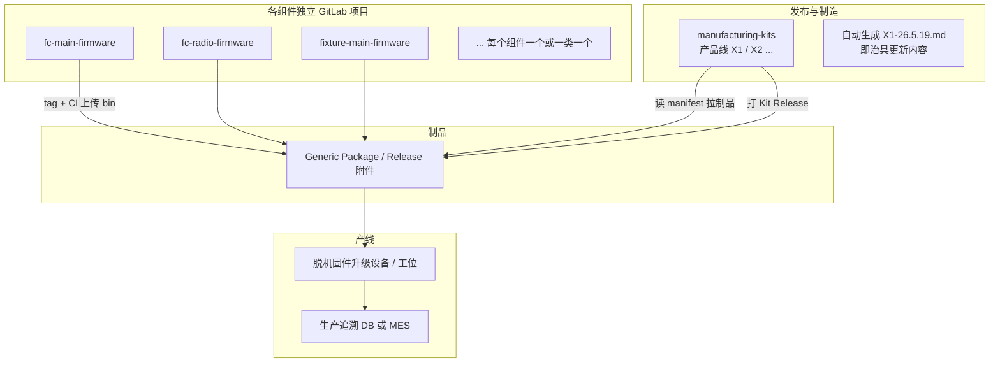

# 生产制造固件与治具 GitLab 管理规划

> 基于 [治具更新内容模板](./治具更新内容模板.md) 中的条目整理。  
> 原则：**各固件/工具独立仓库 + 制造包（Manufacturing Kit）统一发布 + 产线只认 kit_id**。

---

## 一、从模板里抽象出的「生产物料清单」

模板本质是 **一次量产发布（Kit）** 的说明文档，包含约 **18 类** 可独立版本化的组件：

| 分类 | 组件 ID（建议） | 负责人 | 是否必选 |
|------|-----------------|--------|----------|
| 飞控烧录 | `fc-main` 主控 | 廖俊翔 | 必选 |
| 飞控烧录 | `fc-radio` 电台 | 罗品 | 可选 |
| 飞控烧录 | `fc-wifi` 7931/洋葱派 | 陈帅帅 | 可选 |
| 飞控烧录 | `fc-power-board` 开机控制板 | 周由 | 可选 |
| 飞控烧录 | `fc-gps` GPS | 周由 | 可选 |
| 测试治具 | `fixture-main` 主控治具 | 廖俊翔 | 必选 |
| 测试治具 | `fixture-mag` 磁罗盘治具 | 廖俊翔 | 必选 |
| 测试治具 | `fixture-imu` IMU治具 | 廖俊翔 | 必选 |
| 测试治具 | `fixture-light` 灯板治具 | 廖俊翔 | 可选 |
| 其它治具/配件 | `rfid-fixture` | 周由 | 可选 |
| | `ir-remote` | 周由 | 可选 |
| | `charger` | 周由 | 可选 |
| | `power-tester` 测电器 | 周由 | 可选 |
| | `ip-burn-tool` | 周荣鑫 | 可选 |
| | `hf-head` 高频头 | 罗品 | 可选 |
| | `r1-radio` | 周由 | 可选 |
| | `r2-radio` | 罗品 | 可选 |
| | `base-station` 基站 | 周由 | 可选 |

命名习惯（模板已写）：**`{产品线}-{YY.M.D}`**，例如 `X1-26.5.19` → 对应 Git tag / Release 名。

---

## 二、GitLab 总体结构（仓库仍独立）



### 建议仓库划分

| 类型 | 做法 |
|------|------|
| **产品固件** | 一类一仓，如 `x1/fc-main-firmware`、`x1/fc-radio-firmware` |
| **治具固件** | 可合并为 `x1/fixture-firmware`（多 bin）或按治具拆分 |
| **工具** | `x1/ip-burn-tool` 等独立仓（版本节奏与固件不同） |
| **制造包** | 一个产品线一个 meta 仓：`x1/manufacturing-kits`（**无业务代码，只有 manifest + CI**） |
| **文档** | 治具更新 Markdown **不手写维护**，由 CI 从 manifest + 各组件 CHANGELOG 生成 |

「如有」组件：manifest 里 `required: false`，未参与本次 Kit 则整段在生成文档里标 **「本次未更新 / 沿用上一 Kit」**。

---

## 三、核心：manifest（机器读）替代纯手写模板

在 `manufacturing-kits` 仓库中，每个 Kit 一个 YAML，与模板一一对应：

```yaml
# kits/X1-26.5.19.yaml
kit_id: X1-26.5.19
product_line: X1
release_date: 2026-05-19
previous_kit: X1-26.4.12        # 用于「相对上一正式版变更」
validated_by: [廖俊翔, 罗品]     # 集成测试通过签字（可 MR 审批人）
offline_upgrader_min: "2.1.0"   # 脱机升级设备最低版本（若有）

components:
  fc-main:
    project_id: 101
    git_ref: v123.123
    artifact: fc-main-v123.123.bin
    sha256: "..."
    owner: 廖俊翔
    required: true
    changelog_since_prev_kit:      # 或由 CI 从组件 Release Notes 自动合并
      - 支持了 xxx 功能
      - 修复了 xxxx bug

  fc-radio:
    project_id: 102
    git_ref: v45.6
    artifact: fc-radio-v45.6.bin
    required: false                # 本次未改则可 omit 或 inherit_from: X1-26.4.12

  fixture-main:
    project_id: 201
    git_ref: v2.0.1
    artifact: fixture-main-v2.0.1.bin
    required: true
  # ... 其余字段与模板章节同名
```

**规则：**

- 必选组件：Kit 发布前必须在 manifest 里 **显式版本 + 制品已存在**。
- 可选组件：未列则 CI 从 `previous_kit` **继承**上一版引用（文档里写清楚「沿用 X1-26.4.12 之 fc-radio v45.6」）。
- 每个组件仓库打 tag 时 CI 自动：**编译 → 上传 Generic Package → 写 Release Notes**。

---

## 四、与「治具更新内容模板」的对应关系

| 模板字段 | 来源 |
|----------|------|
| 文件名 `X1-26.5.19` | `kit_id` |
| 版本：v123.123 | 各组件 `git_ref` |
| 固件文件：a.bin | `artifact` + Package Registry 路径 |
| 更新内容 1/2/3 | 组件 CHANGELOG ∩「自 `previous_kit` 以来」；CI 自动生成 |
| @负责人 | manifest `owner` + GitLab CODEOWNERS |
| 「如有」 | `required: false` + 继承策略 |
| 脱机固件升级设备 | Kit 元数据 + 单独 `offline-upgrader` 组件（若也算生产物料） |

**发布物目录示例（CI 打 zip）：**

```text
X1-26.5.19/
├── MANIFEST.yaml              # 机器读
├── 治具更新内容-X1-26.5.19.md  # 人类读，版式同现模板
├── CHECKSUMS.sha256
├── firmware/
│   ├── fc-main-v123.123.bin
│   ├── fc-radio-v45.6.bin
│   └── ...
├── fixture/
│   └── ...
└── tools/
    └── ip-burn-tool-...
```

产线 / 脱机升级设备：只部署 **`kit_id` 对应 zip**（或从内网 Registry 按 manifest 拉取）。

---

## 五、流程（谁、何时、做什么）

### 日常：组件独立迭代


### 量产前：组 Kit（对应写一份治具更新文档）

| 步骤 | 动作 | 角色 |
|------|------|------|
| 1 | 在 `manufacturing-kits` 新建 `kits/X1-26.5.19.yaml`，填写/选择各组件 `git_ref` | 发布负责人（如廖俊翔牵头） |
| 2 | 开 MR → 触发 **集成流水线**：下载全部 artifact、跑冒烟/治具联调（若有自动化） | CI + 各 owner 审批 |
| 3 | MR 合并 → tag `X1-26.5.19` | 发布负责人 |
| 4 | CI：生成 Markdown、打 zip、创建 GitLab Release（附件 + Generic Package） | 自动 |
| 5 | 通知生产：仅允许 `X1-26.5.19`；脱机设备刷入该包 | 生产 / 工艺 |
| 6 | 每台（或每批）记录：`SN ↔ kit_id ↔ 时间 ↔ 工位` | 生产 / MES |

### 「距离上一正式版本的所有变更」

- manifest 里固定 `previous_kit: X1-26.4.12`。
- CI 对比两个 manifest 的组件版本差异，对每个 **版本有变** 的组件拉 Release Notes，写入生成 Markdown 的「更新内容」。
- **未变** 的组件在文档中折叠为：「沿用 X1-26.4.12，版本 vxx，无变更说明」。

---

## 六、GitLab 能力映射（具体用什么）

| 需求 | GitLab 用法 |
|------|-------------|
| 仓库独立 | 每组件一 Project，权限按 owner 组划分 |
| 固件二进制 | **Generic Package Registry**（`@kit_id/component/version/file.bin`） |
| 组合发布 | `manufacturing-kits` 的 CI：`curl` 拉各项目 Package + 打 zip |
| 跨项目构建 | **Multi-project pipeline** 或 `trigger` + `needs:artifact` |
| 审批 | Protected tag + MR 需 CODEOWNERS（对应模板里的 @人） |
| 正式版 | Protected branch `main`，Kit 仅能从 MR 合并打 tag |
| 追溯 | Release 页面保留 manifest；生产 DB 存 `kit_id` + `MANIFEST.sha256` |

可选增强：

- **Scheduled pipeline** 检查各组件 `main` 是否有未纳入 Kit 的新 tag（提醒该组 Kit 了）。
- **Compliance**：导出 SBOM（若部分组件用开源库）。

---

## 七、manufacturing-kits 仓库建议目录

```text
manufacturing-kits/
├── README.md
├── kits/
│   ├── X1-26.4.12.yaml
│   └── X1-26.5.19.yaml
├── schema/
│   └── kit.schema.json          # 校验 manifest 字段齐全
├── templates/
│   └── 治具更新内容.md.j2       # Jinja2，版式与现模板一致
├── ci/
│   ├── collect-artifacts.sh
│   ├── generate-release-doc.py
│   └── validate-kit.sh
└── .gitlab-ci.yml
```

`.gitlab-ci.yml` 阶段示意：

1. `validate`：schema + 必选组件 artifact 存在
2. `diff`：相对 `previous_kit` 生成变更摘要
3. `collect`：下载所有 bin 到目录树
4. `document`：渲染 `治具更新内容-X1-26.5.19.md`
5. `package`：zip + sha256
6. `release`：GitLab Release + 上传 Generic Package

---

## 八、产线与脱机升级设备

模板已引用 [脱机固件升级设备](https://www.wolai.com/7b6dCyYPAL7bLs9JDvyLEM)。

| 环节 | 建议 |
|------|------|
| 设备侧 | 只识别 `kit_id` 目录或 `MANIFEST.yaml`，按组件 ID 选 bin 烧录 |
| 升级 Kit | U 盘 / 内网拉 zip；导入前校验 `CHECKSUMS.sha256` |
| 禁止混用 | 工位配置锁定 `current_kit_id`，非本 Kit 拒绝烧录 |
| 追溯 | 烧录完成上报：`SN + kit_id + component_id + firmware_version` |

若脱机设备本身也有程序版本，在 manifest 增加 `offline-upgrader` 组件，与固件同等对待。

---

## 九、角色与职责（对齐模板 @人）

| GitLab 组 | 负责组件示例 |
|-----------|----------------|
| `team-fc` / 廖俊翔 | fc-main、fixture-main/mag/imu/light |
| `team-radio` / 罗品 | fc-radio、hf-head、r2-radio |
| `team-wifi` / 陈帅帅 | fc-wifi |
| `team-embedded` / 周由 | gps、power-board、rfid、charger、r1、base… |
| `team-tools` / 周荣鑫 | ip-burn-tool |
| `release-managers` | 批准 `manufacturing-kits` 的 MR 与 tag |

组件仓库：**owner 打 tag**；Kit 仓库：**release-managers + 相关 owner 审批**。

---

## 十、实施分期（降低一次性迁移成本）

| 阶段 | 目标 | 周期（示意） |
|------|------|----------------|
| **P0** | 必选 4 项先入仓：fc-main、fixture-main/mag/imu；手工 manifest + CI 只打 zip | 2–3 周 |
| **P1** | 全 18 类组件 ID 定稿；自动生成治具更新 Markdown | 2 周 |
| **P2** | 脱机设备读 MANIFEST；生产 SN 追溯 | 视设备能力 |
| **P3** | 集成测试流水线、inherit 可选组件、未纳入 Kit 告警 | 持续 |

---

## 十一、和现有习惯衔接

- 继续用 **`X1-26.5.19` 这种文件名** → 即 `kit_id`，Markdown 由 CI 生成，避免 Wiki/飞书与 Git 两套真相。
- 现有 `治具更新内容模板.md` → 放进 `manufacturing-kits/templates/`，作为 **Jinja2 母版**，字段占位符化。
- 博客仓库里的模板文件可保留作说明，**正式发布以 GitLab `manufacturing-kits` 为准**。

---

## 十二、一次完整发布检查清单

- [ ] 各变更组件已打 tag，Package 中存在对应 `.bin`
- [ ] `kits/X1-26.5.19.yaml` 中 `previous_kit` 正确
- [ ] 必选组件全部有 `git_ref` + `sha256`
- [ ] 可选未改组件已 `inherit_from` 或省略并触发继承逻辑
- [ ] 集成测试 / 治具联调通过（MR 审批）
- [ ] CI 产出 zip + `治具更新内容-X1-26.5.19.md`
- [ ] 生产 / 脱机升级设备已切换 `kit_id`
- [ ] 追溯表能按 SN 查到 `X1-26.5.19`

---

## 附录：背景说明

生产时需要管理的不只是单个 `.bin`，而是一套 **已验证可一起上线** 的组合：

- 飞控烧录固件（主控、电台、WIFI、开机板、GPS 等）
- 测试治具固件（主控、磁罗盘、IMU、灯板等）
- 其它治具与工具（RFID、充电器、IP 烧录工具、电台/基站等）

各组件由不同负责人维护、版本节奏不同，因此适合 **GitLab 多仓库独立开发**，再通过 **manufacturing-kits + manifest** 在发布时打成单一制造包，并自动生成与《治具更新内容模板》同结构的发布说明。
