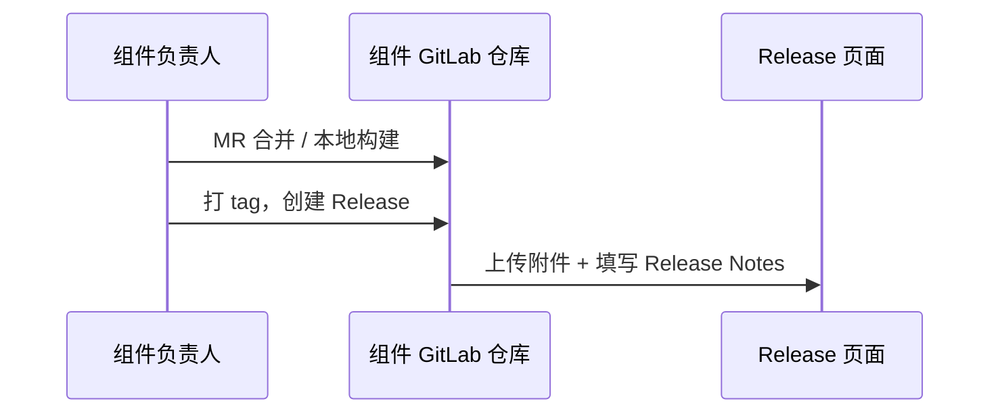
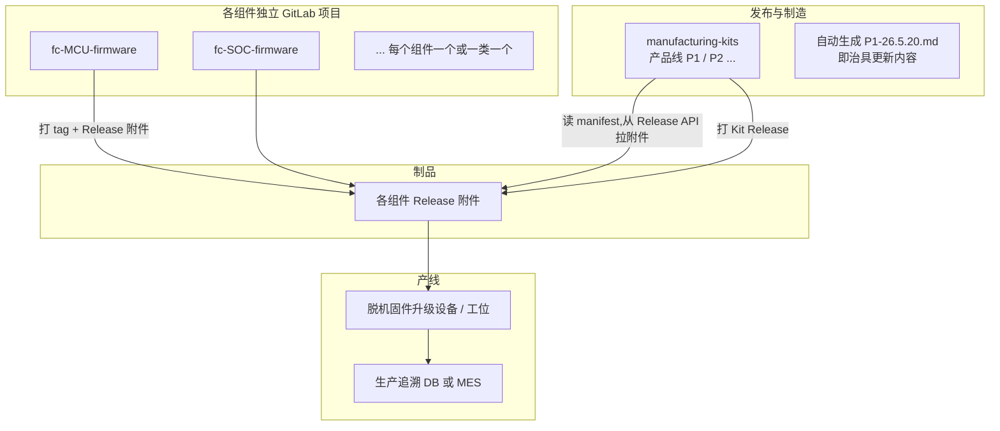

## Foreword

之前理解的制品库就是把CI的中间过程进行存储，虽然也包含了最终发布的部分，但是总觉得没啥大用，就没在意。后续发现其实从工程到生产环节有很多东西都需要进行交付，之前只关注了最核心的产品内容，周边一些零碎的东西，其实也需要被统一管理。而这个时候如果有很多个仓库需要一起进行打包、管理，这个就非常复杂了，而借助CI和制品库就可以通过规则把这部分内容统一管理起来，发布时进行大包发布即可 


## 背景

生产时需要管理的不只是单个 `.bin`或者`.exe`，而是一套 **已验证可一起上线** 的产品组合：

- 硬件烧录固件（SOC、MCU、FPGA等）
- 测试治具固件
- 其它治具与工具（RFID、MAC、IP、参数等配置工具）

各组件由不同负责人维护、版本节奏不同，因此适合 **GitLab 多仓库独立开发**，再通过 **manufacturing-kits + manifest** 在发布时打成单一制造包，并自动生成与发布说明。

#### 目标：组件独立迭代方式



理清思路：

Gitlab 社区版没有制品库或者制品这个概念，但是我们可以通过Gitlab仓库本身的功能，建立一个制品仓库，把制品的manifest文件和对应的CI动作都集成在这个仓库里，需要发版的时候只需要触发这个仓库进行CI即可。

而对于各个仓库来说，完全是不知道这个制品仓库的，从而实现解耦。


##  生产物料清单

首先需要确认实际生产需要的物料清单，并以此为准进行模板制作和规则约束

| 分类 | 组件 ID（建议） | 负责人 | 是否必选 |
|------|-----------------|--------|----------|
| MCU烧录 | `fc-mcu` 主控 | A | 必选 |
| SOC烧录 | `fc-soc` 核心 | B | 可选 |
| 测试治具 | `fixture-mcu` MCU治具 | C | 必选 |
| 测试治具 | `fixture-soc` SOC治具 | A | 必选 |
| 其它治具/配件 | `rfid-fixture` RFID工具 | B | 可选 |
| | `mac-fixture` MAC工具 | C | 可选 |
| | `ip-fixture` IP工具 | A | 可选 |

命名规则：**`{产品线}-{YY.M.D}`**，例如 `P1-26.5.20` → 对应 Git tag / Release 名。

- 一般来说生产是按批或者订单进行的，只涉及到生产改动时这个进行改动即可


## 仓库结构

往往一个仓库可能要应对多种产线的情况，此时仓库保持独立，而不是submodule就很关键



可以看到这种情况下发布制造发起打包，本质上需要一个manifest，这个里面规定了打包的内容


### 仓库划分

建议仓库划分方式，但不是完全说死的

| 类型 | 做法 |
|------|------|
| **产品固件** | 一类一仓，如 `P1/fc-mcu-firmware`、`P1/fc-soc-firmware` |
| **治具固件** | 可合并为 `P1/fixture-firmware`（多 bin）或按治具拆分 |
| **工具** | `P1/ip-burn-tool` 等独立仓（版本节奏与固件不同） |
| **制造包** | 一个产品线一个 meta 仓：`P1/manufacturing-kits`（**无业务代码，只有 manifest + CI**，也可以多产线一个仓库） |
| **文档** | 治具更新 Markdown **不手写维护**，由 CI 从 manifest + 各组件 Release description 生成 |

「如有」组件：manifest 里 `required: false`，未参与本次 Kit 则整段在生成文档里标 **「本次未更新 / 沿用上一 Kit」**。


## manifest模板

在 `manufacturing-kits` 仓库中，每个 Kit 一个 YAML，与模板一一对应：

```yaml
# kits/P1-26.5.20.yaml
kit_id: P1-26.5.20
product_line: P1
release_date: 2026-05-20
previous_kit: P1-26.4.12        # 用于「相对上一正式版变更」
validated_by: [A, B]            # 集成测试通过签字（审批人）
offline_upgrader_min: "2.1.0"   # 升级设备最低版本（若有）

components:
  fc-mcu:
    release_tag: v123.123          # 对应组件仓库 Releases 的 tag
    artifact: fc-mcu-v123.123.bin  # Release 附件名（需含后缀）
    sha256: "..."
    required: true

  fc-soc:
    release_tag: v45.6
    artifact: fc-soc-v45.6.bin
    required: false                # 本次未改则可 omit 或 inherit_from: P1-26.4.12

  fixture-mcu:
    release_tag: v2.0.1
    artifact: fixture-mcu-v2.0.1.bin
    required: true
  # ... 其余字段与模板章节同名
```

**规则：**

- 必选组件：Kit 发布前必须在 manifest 里 **显式 `release_tag` + `artifact`，且组件仓库 Release 已存在**。
- 可选组件：未列则 CI 从 `previous_kit` **继承**上一版引用（文档里写清楚「沿用 P1-26.4.12 之 fc-soc v45.6」）。
- 各组件仓库由 owner **在 Release 页发布附件并填写说明**；制品库 CI **不编译**，只从 Release 拉文件。


#### 示例

| 模板字段 | 来源 |
|----------|------|
| 文件名 `P1-26.5.20` | `kit_id` |
| 版本：v123.123 | 各组件 `release_tag` |
| 固件文件：a.bin | `artifact`（Release 附件名，需与页面上名称一致） |
| 更新内容 1/2/3 | 组件 Release `description`；或 manifest 手写 changelog |
| @负责人 | manifest `owner` + GitLab CODEOWNERS |
| 「如有」 | `required: false` + 继承策略 |
| 脱机固件升级设备 | Kit 元数据 + 单独 `offline-upgrader` 组件（若也算生产物料） |

**发布物目录示例（CI 打 zip）：**

```text
P1-26.5.20/
├── MANIFEST.yaml              # 机器读
├── 治具更新内容-P1-26.5.20.md  # 人类读，版式同现模板
├── CHECKSUMS.sha256
├── firmware/
│   ├── fc-mcu-v123.123.bin
│   ├── fc-soc-v45.6.bin
│   └── ...
├── fixture/
│   └── ...
└── tools/
    └── ip-burn-tool-...
```

产线 / 升级设备：只部署 **`kit_id` 对应 zip**（或从内网按manifest 拉取）。


各仓库的动作：

| 步骤 | 动作 | 角色 |
|------|------|------|
| 1 | 在 `manufacturing-kits` 新建 `kits/P1-26.5.20.yaml`，填写各组件 `release_tag` 与 `artifact` | 发布负责人（如A牵头） |
| 2 | 开 MR → 触发 **集成流水线**：校验 Release 存在、拉取附件（若有自动化测试可在此跑） | CI + 各 owner 审批 |
| 3 | MR 合并 → tag `P1-26.5.20` | 发布负责人 |
| 4 | CI：生成 Markdown、打 zip、创建制品库自身 Release | 自动 |
| 5 | 通知生产：仅允许 `P1-26.5.20`；脱机设备刷入该包 | 生产 / 工艺 |
| 6 | 每台（或每批）记录：`SN ↔ kit_id ↔ 时间 ↔ 工位` | 生产 / MES |


#### manufacturing-kits 仓库目录

```text
manufacturing-kits/
├── README.md
├── catalog/
│   ├── components.yaml
├── kits/
│   ├── P1-26.4.12.yaml
│   └── P1-26.5.20.yaml
├── schema/
│   └── kit.schema.json          # 校验 manifest 字段齐全
├── templates/
│   └── 治具更新内容.md.j2       # Jinja2，版式与现模板一致
├── ci/
│   ├── collect-artifacts.sh
│   ├── generate-release-doc.py
│   └── validate-kit.sh
└── .gitlab-ci.yml
```


`.gitlab-ci.yml` 阶段示意：

1. `validate`：schema + 检查各组件 Release 是否存在
2. `collect`：按 manifest 从各组件 Release API 下载附件
3. `document`：渲染 `更新内容-P1-26.5.20.md`（可合并 Release description）
4. `package`：zip + sha256
5. `release`：制品库打 Kit 的 GitLab Release

注意`manufacturing-kits + manifest` 

- 不是 GitLab 自带的产品功能，需要自建一个 GitLab 仓库 + 写一点 CI/脚本；GitLab 提供的是「存清单、跑流水线、存制品、发 Release、做审批」这些积木。


#### catalog

`manufacturing-kits`的仓库里不仅仅要有各个kit的配置文件，由于各种代码仓库本质上是公用的，所以需要有一个目录层作为更上级，描述各个仓库的路径或者包名什么的，作为公共使用。

```
# 组件 ID → GitLab 项目（仓库路径在 catalog，Kit 里只写 release_tag）
fc-mcu:
  project_path: code/Firmware/fc-mcu
  project_id: 101              # 可选，API 用 id 更稳
  artifact_type: bin
  default_artifact: fc-mcu.bin

fc-soc:
  project_path: code/Firmware/fc-soc
  project_id: 102
  default_artifact: fc-soc.bin

ip-fixture:
  project_path: code/Facility/onion_ip
  project_id: 205
  default_artifact: onion_ip.exe
  branch_is_product_line: true # Release tag 建议形如 X1/v1.0.0

fixture-mcu:
  project_path: code/Facility/fixture-mcu
  project_id: 210
  default_artifact: fixture-mcu.bin
```


对应的CI程序就需要这么执行

```
读 Kit → 拿 fc-mcu 的 release_tag
     → 查 catalog 得 project_path=code/Firmware/fc-mcu
     → GET /projects/.../releases/{tag} → 按 artifact 名下载 assets.links
```


#### 制品模式

有了上面内容以后，就可以给Cursor自动去完成制品库的文件编码了，但是第一次制品的流程，我发现有点问题。

AI默认你的制品库的CI流程是从各个仓库拉代码，然后编译，产生目标文件，然后再打包。其实在生产这里稍微有点点不同，这里各个仓库本身可能不完善（涉及到n多个不同环境），甚至CI流程都不太行，所以这里优先直接拿release页面的文件，而不是把打包编译的流程全跑一遍。

- 对应的release页面这里就需要对应的owner去手动发布，并且编辑更新的内容

基于这个问题，又让AI改了一下制品库的模式


## 实际测试

#### Runner

如果要用Gitlab的CI流水线，那么要先配置好 Runner。可以用 VPS，也可以在内网 Windows 机器上装（例如 `shell` executor + Git Bash），在 GitLab 项目里注册并授权即可


runner可以通过官网下载，然后配置

> https://docs.gitlab.com/runner/install/


```
.\gitlab-runner.exe register  --url https://gitlab.xxxx.com  --token glrt-xxxx3d32-6LxN9
```


runner有一个小细节要注意一下，经常容易卡住流水线，无法正常跑下去

> 你的 CI 里三个 job 都 没有 `tags:`，属于 untagged job。
>
> 若 Runner 配置了标签（例如 `docker`、`build`），且 未勾选「运行未打标签的作业 / Run untagged jobs」，该 Runner 不会接这些 job，界面就会显示「没有可用 Runner」。


建议最好不要在windows上跑runner，很多问题，cmd在最新的runner上不能用，powershell也会有一堆问题（最好用pwsh），建议换成git bash来跑


Job运行时需要访问到各种项目的页面，对应的这些项目就得授权过去，可以在CI/CD的Job token中进行设置


#### Release

调试了老半天，流程总是走不通，不是这有问题，就是那有问题。

后续仔细看了一下发现是Gitlab的一点小问题，AI自己根本搞不明白为什么


这个Release中软件包是只有名称，没有后缀的


而CI文件里写的是需要后缀来识别的，那么一旦子仓库的发布内容不包含这个后缀，那么对应的制品库就无法正常跑下去，这个破问题弄半天，AI自己把自己绕进去了。


除了这个问题，Gitlab还有一点不如Github，发布页面不能直接引用仓库内的文件，不能直接添加资源，不能直接上传，这就导致你要把发布页面包含仓库内的东西就必须走Gitlab CI或者是手写一个脚本利用API来上传文件，然后这里还有坑点。这个你后上传的文件，是有权限的，走CI的那个流水线似乎没权限，访问不到这个链接，而要解决这个问题就还得给CI的脚本配上 owner 的 token，一环扣一环。


#### 子库CI不编译

现在最好的解决办法就是子仓库用Gitlab的CI，但是不编译，仅仅做打包和发布，编译的内容在仓库内建立一个Release文件夹，把每次发布的文件存储到这个里面，由Gitlab CI进行打包和发布即可


制品库环节就和上面说的流程一样走即可


## Summary

所以如果要走Gitlab，那么就得全流程最好都走，想中间偷个懒或者不走Gitlab要解决的问题就有点多了。


## Quote

> Cursor
