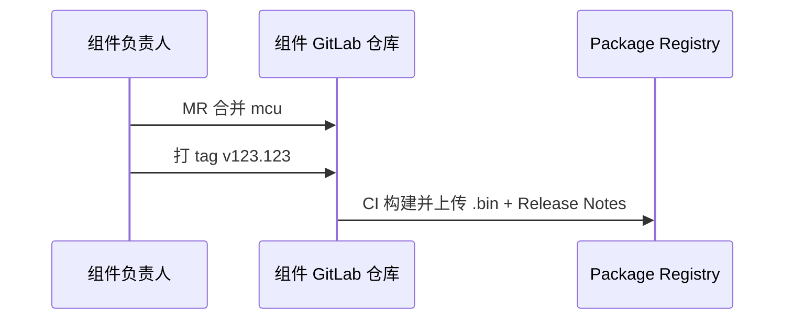
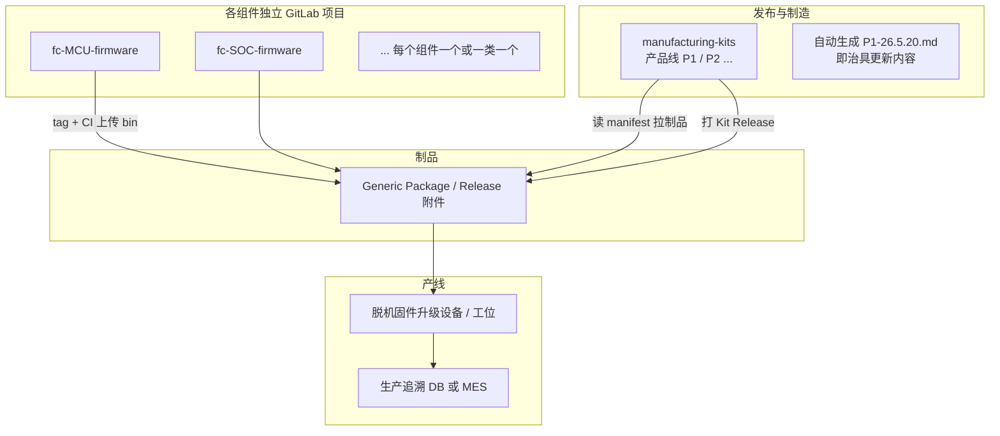

## Forward

之前理解的制品库就是把CI的中间过程进行存储，虽然也包含了最终发布的部分，但是总觉得没啥大用，就没在意。后续发现其实从工程到生产环节有很多东西都需要进行交付，之前只关注了最核心的产品内容，周边一些零碎的东西，其实也需要被统一管理。而这个时候如果有很多个仓库需要一起进行打包、管理，这个就非常复杂了，而借助CI和制品库就可以通过规则把这部分内容统一管理起来，发布时进行大包发布即可


## 背景

生产时需要管理的不只是单个 `.bin`或者`.exe`，而是一套 **已验证可一起上线** 的产品组合：

- 硬件烧录固件（SOC、MCU、FPGA等）
- 测试治具固件
- 其它治具与工具（RFID、MAC、IP、参数等配置工具）

各组件由不同负责人维护、版本节奏不同，因此适合 **GitLab 多仓库独立开发**，再通过 **manufacturing-kits + manifest** 在发布时打成单一制造包，并自动生成与发布说明。

#### 目标组件独立迭代方式



理清思路：

Gitlab 社区版没有制品库或者制品这个概念，但是我们可以通过Gitlab仓库本身的功能，建立一个制品仓库，把制品的menifest文件和对应的CI动作都集成在这个仓库里，需要发版的时候只需要触发这个仓库进行CI即可。

而对于各个仓库来说，完全是不知道这个制品仓库的，从而实现解耦。


##  生产物料清单

首先需要确认实际生产需要的物料清单，并以此为准进行模板制作和规则约束

| 分类 | 组件 ID（建议） | 负责人 | 是否必选 |
|------|-----------------|--------|----------|
| MCU烧录 | `fc-mcu` 主控 | A | 必选 |
| SOC烧录 | `fc-soc` 核心 | B | 可选 |
| 测试治具 | `fixture-mcu` MCU治具 | C | 必选 |
| 测试治具 | `fixture-soc` SOC治具 | A | 必选 |
| 其它治具/配件 | `rfid-fixture`RFID工具 | B | 可选 |
| | `mac-fixture`MAC工具 | C | 可选 |
| | `ip-fixture` IP工具 | A | 可选 |

命名规则：**`{产品线}-{YY.M.D}`**，例如 `P1-26.5.20` → 对应 Git tag / Release 名。

- 一般来说生产是按批或者订单进行的，只涉及到生产改动时这个进行改动即可


## 仓库结构

往往一个仓库可能要应对多种产线的情况，此时仓库保持独立，而不是submodule就很关键



可以看到这种情况下发布制造发起打包，本质上需要一个manifest，这个里面规定了打包的内容


### 建议仓库划分

| 类型 | 做法 |
|------|------|
| **产品固件** | 一类一仓，如 `P1/fc-mcu-firmware`、`P1/fc-soc-firmware` |
| **治具固件** | 可合并为 `P1/fixture-firmware`（多 bin）或按治具拆分 |
| **工具** | `P1/ip-burn-tool` 等独立仓（版本节奏与固件不同） |
| **制造包** | 一个产品线一个 meta 仓：`P1/manufacturing-kits`（**无业务代码，只有 manifest + CI**） |
| **文档** | 治具更新 Markdown **不手写维护**，由 CI 从 manifest + 各组件 CHANGELOG 生成 |

「如有」组件：manifest 里 `required: false`，未参与本次 Kit 则整段在生成文档里标 **「本次未更新 / 沿用上一 Kit」**。


## manifest替代纯手写模板

在 `manufacturing-kits` 仓库中，每个 Kit 一个 YAML，与模板一一对应：

```yaml
# kits/P1-26.5.20.yaml
kit_id: P1-26.5.20
product_line: P1
release_date: 2026-05-20
previous_kit: P1-26.4.12        # 用于「相对上一正式版变更」
validated_by: [A, B]            # 集成测试通过签字（审批人）
offline_upgrader_min: "2.1.0"   # 升级设备最低版本（若有）

components:
  fc-mcu:
    project_id: 101
    git_ref: v123.123
    artifact: fc-mcu-v123.123.bin
    sha256: "..."
    owner: A
    required: true
    changelog_since_prev_kit:      # 或由 CI 从组件 Release Notes 自动合并
      - 支持了 xxx 功能
      - 修复了 xxxx bug

  fc-soc:
    project_id: 102
    git_ref: v45.6
    artifact: fc-soc-v45.6.bin
    required: false                # 本次未改则可 omit 或 inherit_from: P1-26.4.12

  fixture-mcu:
    project_id: 201
    git_ref: v2.0.1
    artifact: fixture-mcu-v2.0.1.bin
    required: true
  # ... 其余字段与模板章节同名
```

**规则：**

- 必选组件：Kit 发布前必须在 manifest 里 **显式版本 + 制品已存在**。
- 可选组件：未列则 CI 从 `previous_kit` **继承**上一版引用（文档里写清楚「沿用 P1-26.4.12 之 fc-soc v45.6」）。
- 每个组件仓库打 tag 时 CI 自动：**编译 → 上传 Generic Package → 写 Release Notes**。


#### 示例

| 模板字段 | 来源 |
|----------|------|
| 文件名 `P1-26.5.20` | `kit_id` |
| 版本：v123.123 | 各组件 `git_ref` |
| 固件文件：a.bin | `artifact` + Package Registry 路径 |
| 更新内容 1/2/3 | 组件 CHANGELOG ∩「自 `previous_kit` 以来」；CI 自动生成 |
| @负责人 | manifest `owner` + GitLab CODEOWNERS |
| 「如有」 | `required: false` + 继承策略 |
| 脱机固件升级设备 | Kit 元数据 + 单独 `offline-upgrader` 组件（若也算生产物料） |

**发布物目录示例（CI 打 zip）：**

```text
P1-26.5.20/
├── MANIFEST.yaml              # 机器读
├── 治具更新内容-P1-26.5.20.md  # 人类读，版式同现模板
├── CHECKSUMS.sha256
├── firmware/
│   ├── fc-mcu-v123.123.bin
│   ├── fc-soc-v45.6.bin
│   └── ...
├── fixture/
│   └── ...
└── tools/
    └── ip-burn-tool-...
```

产线 / 升级设备：只部署 **`kit_id` 对应 zip**（或从内网按manifest 拉取）。


各仓库的动作：

| 步骤 | 动作 | 角色 |
|------|------|------|
| 1 | 在 `manufacturing-kits` 新建 `kits/P1-26.5.20.yaml`，填写/选择各组件 `git_ref` | 发布负责人（如A牵头） |
| 2 | 开 MR → 触发 **集成流水线**：下载全部 artifact、跑冒烟/治具联调（若有自动化） | CI + 各 owner 审批 |
| 3 | MR 合并 → tag `P1-26.5.20` | 发布负责人 |
| 4 | CI：生成 Markdown、打 zip、创建 GitLab Release（附件 + Generic Package） | 自动 |
| 5 | 通知生产：仅允许 `P1-26.5.20`；脱机设备刷入该包 | 生产 / 工艺 |
| 6 | 每台（或每批）记录：`SN ↔ kit_id ↔ 时间 ↔ 工位` | 生产 / MES |


## manufacturing-kits 仓库建议目录

```text
manufacturing-kits/
├── README.md
├── kits/
│   ├── P1-26.4.12.yaml
│   └── P1-26.5.20.yaml
├── schema/
│   └── kit.schema.json          # 校验 manifest 字段齐全
├── templates/
│   └── 治具更新内容.md.j2       # Jinja2，版式与现模板一致
├── ci/
│   ├── collect-artifacts.sh
│   ├── generate-release-doc.py
│   └── validate-kit.sh
└── .gitlab-ci.yml
```

`.gitlab-ci.yml` 阶段示意：

1. `validate`：schema + 必选组件 artifact 存在
2. `diff`：相对 `previous_kit` 生成变更摘要
3. `collect`：下载所有 bin 到目录树
4. `document`：渲染 `治具更新内容-P1-26.5.20.md`
5. `package`：zip + sha256
6. `release`：GitLab Release + 上传 Generic Package

注意`manufacturing-kits + manifest` 

- 不是 GitLab 自带的产品功能，需要自建一个 GitLab 仓库 + 写一点 CI/脚本；GitLab 提供的是「存清单、跑流水线、存制品、发 Release、做审批」这些积木。


## 实际测试


## Summary


## Quote


> Cursor
