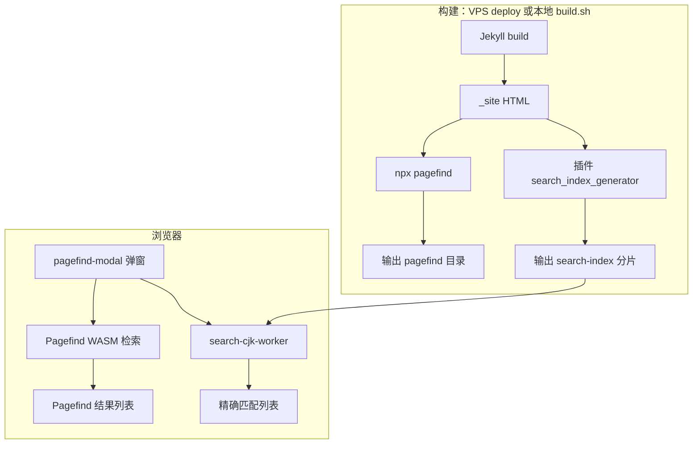

## Foreword

博客文章越来越多，靠标签和翻页找东西越来越费劲。站点是 Jekyll 静态部署在 VPS 上的，不想为了搜索再挂一个 Elasticsearch 或者 Meilisearch，所以目标是：**构建时生成索引，线上纯静态文件，浏览器里完成检索**。

试了一圈以后，最终用的是 **Pagefind + 自建的子串索引** 双轨方案。这篇文章记录选型过程、当前实现，以及和其他方案的对比，方便以后自己维护或者换方案时有个参照。

## Pagefind

> https://pagefind.app/

[Pagefind](https://pagefind.app/) 是 MIT 协议的开源静态站搜索库，和 Algolia DocSearch 那种「云端 API」不同，它完全跑在访客浏览器里：

1. **构建阶段**：`jekyll build` 产出 HTML 后，执行 `npx pagefind`，扫描带 `data-pagefind-body` 的正文区域，按语言规则分词，生成倒排索引（`.pf_index`、`.pf_meta`、`.pf_fragment` 等），和站点一起部署。
2. **使用阶段**：页面加载 `pagefind.js` + WASM，用户输入查询词后同样在客户端分词，在索引里匹配、排序，再拉摘要片段显示。

可以粗浅地理解成：**离线建好「词 → 出现在哪些页面」的表，上线后只在浏览器里查这张表**。它保证的是正文进了索引、能全站检索，但检索单位是 **token（词）**，不是「任意连续汉字串」

- 这点和后面中文踩坑直接相关，说白了就是所谓的分词对于中文的适配度低，很多中文词分词不正确导致没有被索引

本站 `pagefind.yml` 里配置了 `force_language: zh-cn`，npm 依赖目前是 `pagefind ^1.5.2`（1.5 起对 CJK 有加强，仍解决不了所有短语场景）。

## Pagefind +自建索引

整体是 **双轨**：Pagefind 负责广搜和 UI；`search-index` 负责中文 **连续子串** 的精确匹配。导航栏「搜索」+ `Ctrl+K` 打开同一个 Pagefind 弹窗，精确匹配结果插在 Pagefind 结果列表上方。

### 构建链路

VPS 上 `deploy.sh` 在 `git pull` 后有更新时执行：

1. `jekyll build --destination /usr/share/nginx/html`
2. `npx pagefind --site /usr/share/nginx/html`
3. `search-index` 由 Jekyll 插件 `_plugins/search_index_generator.rb` 在 `post_write` 钩子里生成（Node 脚本 `scripts/build-search-index.mjs` 仅作备用）

本地开发可用 `./build.sh`，步骤相同。

### Pagefind改动

- 正文容器：`_layouts/post.html` 里 `post-container` 带 `data-pagefind-body`；标题、副标题、标签用 `data-pagefind-meta`。
- 忽略区域：导航、页脚、`data-pagefind-ignore`（见 `pagefind.yml` 的 `exclude_selectors`）。
- 前端：`footer.html` 引入 `pagefind-component-ui.js`、`pagefind-modal`；`nav.html` 搜索按钮打开弹窗。

Pagefind 适合：**英文单词、长文全文、模糊相关内容**；摘要高亮、子结果锚点也是它自带的。

### 自建索引改动

中文博文里大量 **造词、地名、产品名**（如「限宽墩」「奥美品牌定位」），读者往往是「记得这几个字连在一起」来搜。Pagefind 会把查询拆成更小的 token，容易出现：

- 搜「限宽墩」命中别的文章里的「限制」「路宽」「墩子」

- 真正写有「限宽墩」的《天津自驾游》反而直接搜不到了

因此在 Pagefind 之外增加 **子串索引**：

| 项目 | 说明 |
|------|------|
| 路径 | `/search-index/manifest.json` + `/search-index/2015.json` … `2026.json` |
| 单条格式 | `[url, title, searchableText]`，无重复字段 |
| 可搜内容 | 标题、副标题、正文内所有 `h1–h6` 标题文字、正文纯文本前 800 字 |
| 匹配方式 | `indexOf(查询词)`，必须 **连续子串** 命中 |
| 运行时 | 打开搜索框后加载 manifest，Worker 并行拉各年分片，在后台线程检索，不堵 UI |
| 展示 | 弹窗内「精确匹配（N）」列表，样式对齐 Pagefind 卡片 |

根路径 `/search-index.json` 只剩几十字节的指针：`{"v":2,"manifest":"/search-index/manifest.json"}`。全部分片合计约 **880KB**（单文件 JSON 塞全文，体积到 **9.7MB**，首屏解析卡死，就放弃了）。

相关文件：

- `_plugins/search_index_generator.rb` — 构建分片索引
- `js/search-cjk-fallback.js` — 挂接弹窗、调度 Worker
- `js/search-cjk-worker.js` — 拉分片、子串搜索

### Service Worker

博客开了 PWA，`js/sw.js` 对 `/pagefind/`、`/search-index/`、`search-cjk-*.js` 走 **network-only**，避免旧索引被 SW 缓存导致「新文章搜不到」。缓存命名空间已迭代到 `main-v5-`，改版后需要用户注销一次 SW 或硬刷新。

## 踩过的坑

| 现象 | 原因 | 处理 |
|------|------|------|
| 新文章搜不到 | SW 缓存了 `/pagefind/` | SW 对 pagefind 路径不缓存 |
| `search-index.json` 404 | 仅本地 build 未部署插件产物 | Jekyll 插件随 build 生成；deploy 检查 manifest |
| 搜「品牌定位」有数量无列表 | 过滤逻辑藏光 Pagefind 结果 + 注入被重绘清掉 | 独立 `pf-cjk-results` 容器，去掉误杀过滤 |
| 一直「正在搜索」 | 单文件 9.7MB 主线程 `JSON.parse` | 按年分片 + 仅打开搜索时加载 + Worker |
| 「限宽墩」精确匹配没有天津篇 | 词在文末 `####`，800 字截断未覆盖 | 索引增加全文标题层级文字 |

典型验证词：**品牌定位**（标题命中）、**限宽墩**（小节标题 + 正文）、**奥美品牌定位**（标题子串）。

## 子串包含 vs 分词

| | **子串包含**（search-index） | **分词**（Pagefind / jieba） |
|--|------------------------------|------------------------------|
| 规则 | 连续字符序列出现即命中 | 先切词，再按词匹配 |
| 适合 | 限宽墩、品牌定位、Su7 Ultra | 营销、自驾、STM32 等主题词 |
| 误匹配 | 少（要求连续） | 中文易拆字沾边 |
| 新造词 | 不依赖词典 | 词典没有则易切错 |

改善 Pagefind 中文 **不等于只改 jieba**：还要改查询侧分词、匹配是否要求连续、标题权重等；对个人博客维护一个 Rust/WASM fork 不划算。更务实的做法是：**Pagefind 继续广搜，子串索引补短语**

## 方案对比

| 方案 | 类型 | 中文短语 | 集成成本 | 运维 | 备注 |
|------|------|----------|----------|------|------|
| **Pagefind + search-index（当前）** | 静态双轨 | 子串轨准确 | 中（已落地） | 仅 nginx 静态 | UI 现成，构建多一步 |
| **仅 Pagefind** | 静态 | 弱 | 低 | 静态 | 英文体验好，中文词组不稳 |
| **FlexSearch / MiniSearch** | 纯前端 | 可配 CJK encoder 或构建期分词 | 中高（自写 UI） | 静态 | 索引逻辑自控，无官方弹窗 |
| **Lunr + 中文扩展** | 构建期索引 | 依赖分词 trimmer | 中高 | 静态 | Hexo/Hugo 常见，Jekyll 需自己接 |
| **hexo-tokenize-search 思路** | 构建 search.json | 构建期 tokenize | 中 | 静态 | 和 search-index 类似，需移植 |
| **Meilisearch / Typesense** | 独立服务 | 好 | 高 | 需 Docker/进程 | 体验最好，违背「纯静态」初衷 |
| **Algolia DocSearch** | SaaS | 好 | 低（若符合条件） | 云端 | 开源文档站为主，个人博客未必合适 |
| **Fork Pagefind 改中文** | 改 Rust/WASM | 可做成子串或更好分词 | 很高 | 静态 | MIT 允许，长期合并上游成本高 |

没有找到一个「魔改 Pagefind 中文版」的成熟 Fork；官方在 Issue 里讨论 CJK 子串（如 #987），上游演进可跟，不必私有维护一整条搜索引擎分支。

## Summary

博客搜索采用 **Pagefind（分词全文 + 弹窗 UI）+ 按年分片的子串索引（中文短语精确匹配）**。构建时 Jekyll 与 Pagefind CLI 各生成一套静态数据；使用时同一弹窗先展示精确匹配，再展示 Pagefind 结果。中文技术文里造词、固定词组多，**子串包含**比单纯优化 jieba 更贴需求；Pagefind 仍保留，负责英文、长文深处和模糊检索。若以后文章量或需求变化，可以考虑只强化子串轨（甚至去掉 Pagefind），或给上游贡献 CJK 子串模式，但现阶段双轨是性价比最高的平衡点。

由于有AI，所以Pagefind fork以后修改的方式也试过了，本地测试走通了，拿我整个Blog的词都做过测试，分词效果比官方好多了，也就不需要什么search-index了，但是上线的时候发现有问题。Blog都是在老VPS上了，CentOS，Pagefind编译是在另外一个VPS上，编译后的结果呢，CentOS跑不了，老VPS呢内存太小，跑不了Pagefind编译，好家伙给我死锁了。

要动老VPS的环境，相关要重新部署或者修改的内容有点太多了，于是就放弃了，AI修改Pagefind还是比较简单的，下次VPS换了再换成私有Pagefind也可以。

## Quote

> cursor
>
> 本文80%由AI生产

