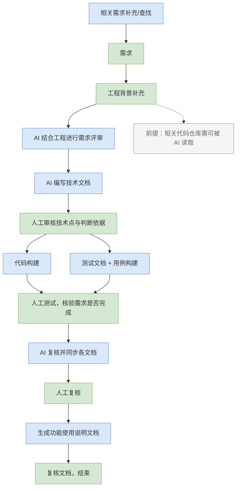
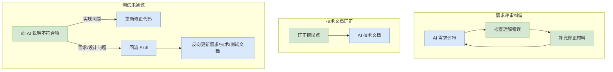
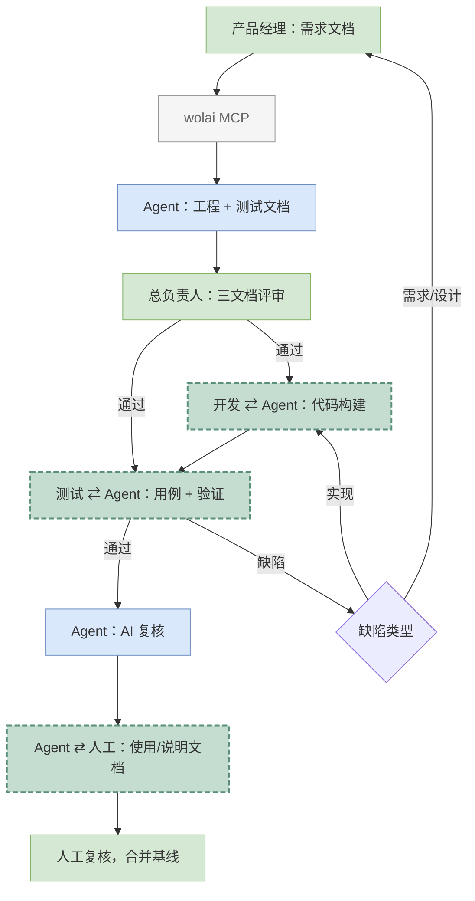

## Foreword

前段时间在 wolai 里把一套「一个人带 Agent 做产品」的流程摸清楚了，顺手画了一张图，又写了一份更偏团队协作的 Agent 方案。下文先展开独自开发（AIO）如何把产品、开发、测试、总负责人压缩成「你 + Agent」；再讲团队版（FTM）如何拆回四个岗位。文档怎么流转、人在哪几步必须插手、以及怎么把踩过的坑固化成 Skill，两家共用。

AIO，All-in-one

FTM，Four man team


#### 为什么要先定工作流

AI 写代码很快，快到你还没来得及想清楚需求，它已经给你造了三层抽象、两个 Design Pattern 和一个你根本没要的缓存层。没有流程约束，Agent 就像个热情过头的实习生：活干得猛，方向全靠猜，你没规范的内容往往走出了意想不到的呈现方式。

所以我现在的原则是：**先文档、后代码；先评审、后构建；缺陷不只改代码，还要反向更新文档。** 文档全部放在 wolai，暂时不进 Git 仓库——wolai 自带版本历史，需求和工程文档跟代码解耦，Agent 通过 MCP 读写文档，人负责拍板。


开发分为好几种

1. 从0开始的，业务是全新的，不需要理解之前的东西，很简单，全部交给AI即可
2. 从0.5开始，业务已经存在了，是对已有业务的修改或者补充，需要让AI知道当前业务到底是什么，上下文、对齐非常重要
3. 从1开始，业务完整，对某些小bug，涉及内容非常小的进行修改或者找到bug所在
4. 核心性能或者算法或者非常小众领域的类型开发，创新式的，AI很难给出满意的答案

目前Agent主要解决的是1、2、3，能完全交给Agent的基本是1和3，2需要大量的上下文和超级健全的工程框架


## AIO 整体流程

流程图里绿色节点是**人工**，蓝色是 **AI**。主流程自上而下阅读（需求在顶、交付在底）；评审纠偏与缺陷回流单独成图，避免横向过宽。

**主流程**



**评审纠偏与缺陷回流**（主流程中未通过时进入）



核心链路如下：

1. **需求输入**：产品需求写在需求文档中（评审后的版本）。AI 可辅助「相关需求补充/查找」，但**需求正文不允许 AI 0-1 生产，只允许补充和审查**——方向错了后面全白干。
2. **工程背景补充**：人工补充本需求涉及的仓库、模块、历史决策、接口约束。前提：**相关代码仓库都要能被 AI 读到**（Cursor 打开多仓库工作区、MCP filesystem都需要准备好）。
3. **AI 需求评审**：Agent 结合工程上下文审需求，标出歧义、遗漏、与现有架构冲突的点。
4. **人工纠偏**：检查 AI 有没有理解错；把补充材料、对开放问题的答复写回 需求文档。
5. **AI 编写技术文档**：输出工程设计（模块划分、接口、数据流、边界条件）。同步可起草测试文档骨架。
6. **人工审核技术文档**：重点看技术选型依据、判断条件、隐含假设有没有跑偏；错了就「订正错误点」打回，对了才往下走。
7. **并行构建**：**代码构建**与**测试用例构建**同时进行——代码里最好包含 CI/CD，交到测试环节时应是可运行的完整产物，而不是半截子 PR。
8. **人工测试**：按测试文档走流程，核验需求是否真正完成。有问题就逐条告诉 AI 哪里不对，进入「重新修正代码」循环。
9. **缺陷回流**：若发现的是需求/设计层面的问题，不能只改代码——要回流更新需求、技术、测试文档，并补上对应用例。
10. **AI 复核**：开发完成后，让 Agent 交叉检查需求、工程、测试、实现是否一致，文档是否互相印证，能否交付、能否合并主分支作为下一迭代基线。
11. **人工复核 + 使用文档**：人做最后一眼；AI 基于定稿内容生成面向用户/运维的说明文档，再复核一遍，结束。

用一句话概括：**人定方向、人审关键节点；AI 写文档、写代码、写用例、做一致性检查；文档作为单一事实来源。**


下面是一个核心的 `task.md` 示例：补充项目信息、开发规范和任务需求，也记录 Agent 各步操作。每轮会话 Agent 都先读它再继续，整体进度同步在这里。想接续开发或并行多任务，复制一份 task 即可，互不干扰。

```
# 任务：abc-123

> 本文件分两部分：**【一、任务信息】** 初始化时填写、相对稳定；**【二、进度与共创记录】** 开发过程中动态更新。
> 新任务：复制本结构，重填「一」、清空「二」即为初始状态。多任务并行时每个任务一份（见 `docs/tasks/<需求ID>.md`），会话开始时指定要接续的任务。

---

# 一、任务信息（初始化头部）

## 基本信息

| 项 | 值 |
| --- | --- |
| 需求 ID | abc-123 |
| 标题 | 需求abc-123 |
| 类型 | feature |
| 模式 | solo（AIO） |
| 开发分支 | `abc` |
| 基线 | `dev` |

## 文档链接

| 文档 | 链接 |
| --- | --- |
| 需求页 | [A](https://www.wolai.com/abc) |
| 技术+测试 | [B](https://www.wolai.com/abc) |

## 关联工程项目（workspace）

- A
- B
- C

## 涉及模块

- A
- B
- C

## 架构与规范要求

- 语言/框架
- MVVM：新代码 `CommunityToolkit.Mvvm`；遗留 `PropertyChanged.Fody`
- 日志：结构化日志
- 本地化：zh-cn / en-us
- 格式/注释：
- 测试：

---

# 二、进度与共创记录

## 当前阶段

**S9 代码实现（已含 S11 复评修复；待人工确认推进 S10+）**

### 阶段清单

- [x] S0 开工登记（Wolai 需求页）
- [x] S1 需求输入
- [x] S2 工程背景（技术页 §0）
- [x] S3 需求评审
- [x] S4 人工纠偏（评审表已确认）
- [x] S5 技术+测试起草（技术页 §9–§11）
- [x] S6 审核技术
- [x] S7 测试二次补全（技术页 §11.2）
- [x] S8 评审关口（已确认进入 S9）
- [x] S9 并行构建（代码 + 33 项自动化回归 + CI）
- [ ] S10 人工测试
- [ ] S11 AI 复核（评审问题修复已先行完成）
- [ ] S12 使用说明（已写回 wolai 需求页 S12）
- [ ] S13 合并基线

## 待反馈 / 开放问题

- 暂无。

## 已确认结论（摘要）

## 变更记录

## 实现摘要 / 行动记录

```


## FTM 团队协作版

FTM（Four Man Team）是上文 AIO 的扩展：流程骨架相同，但把人拆回四个角色，各管一摊，Agent 穿插在文档生成、代码构建和一致性复核里，人负责方向、评审和拍板。


**角色分工**

| 角色 | 主要职责 |
|------|----------|
| 产品经理 | 维护需求文档与总体进度看板；**需求由人写，AI 只审不改** |
| 软件开发工程师 | 补充工程背景；与 Agent 结对完成代码构建和 Code Review |
| 自动化测试工程师 | 审测试文档、补探索性用例；跑自动化 + 人工流程验证 |
| 总负责人 | 需求/技术/测试三份文档**最终评审拍板**；决定是否进入开发与合并 |

文档全部落在 wolai，暂不进 Git 仓库——wolai 自带版本历史，需求和工程文档与代码解耦，各角色通过 MCP 读写同一份需求页下的子文档。


**团队版主流程**

图例：绿色 = 人工主导，蓝色 = Agent 主导，**青绿色（虚线边框）** = 人机协作（结对进行）。



各阶段要点：

1. **需求文档**：产品写好评审后的需求，经 wolai MCP 交给代码仓库内的 Agent 读取分析，输出工程设计文档，可同时起草测试文档；工程/测试文档**回写**到同一需求页下。
2. **技术文档**：定稿后测试同学二次补全——把技术边界、隐含状态、异常路径补进用例。不熟悉项目时，可先让 Agent 根据需求梳理「可能涉及的技术面」，再写正式工程文档。
3. **评审关口**：需求、技术、测试三份文档全部评审通过后，Agent 才**严格按文档开发**，人做辅助；评审结论回写 wolai，未通过不得大规模写代码。
4. **代码构建**：开发与 Agent 结对写代码；Code Review 人机一起做。构建含 CI/CD，交到测试时应是可运行的完整产物。
5. **测试验证**：自动化用例与代码同步开发；测试工程师跑用例 + 人工走流程。缺陷按类型回流——实现问题回开发，需求/设计问题回产品/工程文档，**重新走评审（可快速）**后再动代码。
6. **使用文档**：功能交付前，Agent 生成面向用户/运维的说明文档。
7. **人工与AI 复核**：交叉检查需求、工程、测试、实现是否一致、能否互相印证、能否交付客户、能否合并主分支作为下一迭代基线。


**尚待补齐的环节**

团队版比 AIO 多出来的主要矛盾是**文档变更通知**：

- 需求变了 → 技术、测试要收到通知并同步改文档  
- 技术/需求变了 → 测试要收到通知并补用例  

现阶段可人工拉群喊一嗓子，也可以挂一个「监控 Agent」盯 wolai 页面版本差异，触发快速重评审。单人可以靠记忆力，团队版这里需要补足。


**并行需求**

多个需求若不耦合、不冲突，本地copy多个仓库，从同一基线切不同分支，各开一条 Agent 会话并行开发，互不影响。


**与 AIO 独自版的差异**

| 维度 | FTM 团队版 | AIO 独自版 |
|------|------------|------------|
| 看板与进度 | 产品维护 | 自己维护 wolai 需求页 |
| 评审拍板 | 总负责人终审 | 「未来的自己」隔几小时/隔天再审 |
| 测试用例 | 测试工程师主导，Agent 起草 | Agent 起草 + 自己补探索性测试 |
| 跨端协作 | 多方 Agent + 协议文档联调 | 多仓库各开 Agent，协议为边界 |
| 变更通知 | 需显式机制（人或监控 Agent） | 容易遗漏，靠 checklist 自律 |

核心原则两家共用：**先文档后代码、评审不过不构建、缺陷回流文档、合并前 AI 复核。** AIO 是 FTM 的角色折叠版，不是另一套流程。


## 注意事项

**1. 需求不能让 AI 代写**

可以让 AI 审查需求、找漏洞、补边界问题；但「要做什么」必须人说了算。否则 Agent 会悄悄帮你 scope creep，最后做出来的是「技术上很完整但没人要」的东西。

**2. 评审不过，禁止进入代码阶段**

评审不是形式主义。需求、技术、测试三份文档没对齐之前，不要让 Agent 大规模写代码。返工成本通常是正向开发的数倍，而且 AI 返工特别喜欢「再叠一层兼容层」，债越欠越多。

**3. 代码仓库可读性是前置条件**

工程背景补充那一步如果虚了，后面技术文档全是幻觉。确保相关 repo 在 Cursor 工作区内，或 MCP 能访问；单体产品就把文档和代码放同一 workspace。

**4. 人机结对 Review，不是 AI 独审**

代码合并前：人看业务逻辑、安全、边界；AI 看样板代码、明显 bug、风格一致性。Anthropic 自己也是这个路子。再强的模型也会漏，人也不能只肉眼看 diff。

**5. 测试文档要跟着技术文档长第二遍**

第一遍测试用例来自需求；技术文档定稿后，AI 应二次补全——把实现里的隐含状态、错误码、并发边界补进用例。这一步跳过，人工测试很容易漏「文档里没写但代码里做了」的行为。

**6. 缺陷要分流，别只会「让 AI 再改改」**

- 实现 bug → 改代码，必要时补用例  
- 设计/需求问题 → 回流文档，**快速重评审**，再改代码  
- 只改代码不更新文档，下一轮 Agent 还是会按旧文档理解，同一个坑踩两次

**7. 文档变更要有通知机制**

团队版可以靠人喊一嗓子；独自版容易忘。实践里要么自己养成「改需求必改技术/测试」 checklist，要么用Skill或者规则把这里约束住。

**8. 敏感信息别进 prompt**

密钥、内网地址、客户数据别贴给云端模型。工程文档里用占位符，本地 `.cursor/rules` 或环境变量说明真实配置。

**9. 会话粒度：一个需求一条线**

不要把五个不相关需求塞进同一个 Agent 会话。上下文越长，早期约束越容易被「遗忘」；开新会话时把 wolai 文档链接和当前分支名重新喂一遍。


## 从工作流到稳定 Skill

流程跑通几次之后，重复劳动会冒出来：每次都要提醒 Agent「先读 wolai」「评审不过别写代码」「缺陷要回流文档」。**Skill 就是把这套口头规矩写成 Agent 能自动加载的说明书。**

````
---
name: agent-workflow
description: >-
  Unified Agent product development workflow (AIO solo + FTM team): wolai docs,
  review gates, code/tests, defect doc sync, pre-merge audit. Use when starting
  features or bugfixes, 按工作流开发, AIO, FTM, 独自开发, 团队协作, 需求评审,
  回流文档, 合并前复核, or wolai Agent workflow.
---

# Agent 产品开发工作流

单一 Skill，内含 AIO 独自版、FTM 团队版与全部子流程。**加载本 Skill 后按「模块路由」读取对应章节执行，无需再 @ 其他 skill。**

## 核心原则

**先文档、后代码；先评审、后构建；缺陷不只改代码，还要反向更新文档。**

- **`docs/task.md` 是每个需求的核心维护文档（本地、单一事实来源）**：当前阶段、进度、待办、需要人反馈/确认的问题、已确认结论摘要、实现摘要、变更记录都实时写在这里。每轮会话**先读它、随时更新它**。
- **wolai 需求/技术/测试页是定稿沉淀**：仅当①需求发生变动，或②某些内容（评审结论、技术方案、用例、设计决策）已明确/经人确认时，由 Agent 把对应内容回写 wolai（追加或更新已有段落，**不注入固定填空模板**、不覆盖人已确认内容）。
- 代码在 workspace。task.md 与 wolai 的关系：task.md 记「正在进行/待定」，wolai 记「已定稿/共享」。

## 会话启动（每轮必做）

1. 读 `docs/task.md` → 确认当前阶段、进度、待反馈项、文档链接（**以 task.md 为状态来源**）
2. 需要已确认的需求/技术/用例细节时，再按 task.md 中链接读对应 wolai 页
3. 若无 `docs/task.md`，或无开工信息（无页面 ID / 无分支）→ 执行 [modules/create-kit.md](modules/create-kit.md)（同时建立 `docs/task.md`）
4. 确认模式：`solo`（AIO）或 `team`（FTM）
5. 声明本步阶段 ID、是否允许写业务代码

## 硬性约束

```
三文档 S8 评审未全通过 → 禁止改 src/ 等业务代码
缺陷类型 design|requirement → 先走 modules/defect-sync.md，人确认后再改代码
需求正文禁止 AI 0-1 生产，仅审查与补充
一个需求 = 一条 Agent 会话
密钥/内网/客户数据禁止进 prompt
```

## 阶段与关口

| ID | 名称 | 主导 | 写代码 |
|----|------|------|--------|
| S0 | 开工登记 | 🤖 | ❌ |
| S1 | 需求输入 | 👤 | ❌ |
| S2 | 工程背景 | 👤 | ❌ |
| S3 | AI 需求评审 | 🤖 | ❌ |
| S4 | 人工纠偏 | 👤 | ❌ |
| S5 | 技术+测试起草 | 🤖 | ❌ |
| S6 | 审核技术 | 👤 | ❌ |
| S7 | 测试补全 | 🤖 | ❌ |
| S8 | 评审关口 | 👤 | ❌ |
| S9 | 并行构建 | 🤖 | ✅ |
| S10 | 人工测试 | 👤 | ✅ 修 bug |
| S11 | AI 复核 | 🤖 | ✅ 修缺口 |
| S12 | 使用说明 | 🔀 | ❌ |
| S13 | 合并基线 | 👤 | ❌ |

**S8 关口（全满足才可 S9）**：P0 有验收标准；技术含错误码与边界；测试覆盖 P0；开放问题已决议；评审记录已回写。

**Bugfix 快速路径**：人填复现与范围 → 可选 AI 简评 → 人确认 → 直进 S9（至少 1 条测试用例）→ S10–S13 同 feature。

**阶段推进**：关键关口需人回复「确认进入 S{n}」后 Agent 才更新阶段；禁止跳阶段（bugfix 可走 B 路径）。

## 模块路由

| 场景 | 阶段 | 读取 |
|------|------|------|
| 新需求/bug 开工 | S0 / B0 | [modules/create-kit.md](modules/create-kit.md) |
| 独自开发全流程 | S0–S13 | [solo-workflow.md](solo-workflow.md) |
| 团队开发全流程 | S0–S13 | [team-workflow.md](team-workflow.md) |
| 需求评审 | S3 | [modules/requirement-review.md](modules/requirement-review.md) |
| 测试失败/需求变更 | 任意 | [modules/defect-sync.md](modules/defect-sync.md) |
| 合并前复核 | S11 | [modules/pre-merge-audit.md](modules/pre-merge-audit.md) |

**阶段 → 模块自动映射**（用户未明说时按需求页当前阶段）：

| 阶段 | 执行模块 |
|------|----------|
| S0, B0 | create-kit |
| S1–S2, S4, S6, S8, S10, S12–S13 | solo 或 team 工作流（按 MODE） |
| S3 | requirement-review |
| S5, S7, S9 | solo/team 工作流 |
| S11 | pre-merge-audit |
| 测试失败且类型未定 | 先分流 → defect-sync 或直改代码 |

## 模式选择

| 模式 | 文档 | 适用 |
|------|------|------|
| `solo` | [solo-workflow.md](solo-workflow.md) | 一人兼 PM/DEV/QA/Lead |
| `team` | [team-workflow.md](team-workflow.md) | PM、DEV、QA、Lead 分工 |

未说明时默认 `solo`；用户提 FTM/团队/四人团队 → `team`。

## 文档分工（无固定模板）

| 文档 | 人写 | Agent 写 | 人审 |
|------|------|----------|------|
| 需求 | 背景、范围、功能点、验收标准 | 评审意见（S3） | S4、S8 |
| 技术 | 工程背景（S2） | 方案、接口、数据流（S5） | S6、S8 |
| 测试 | 探索性结论（S10） | 用例起草与补全（S5/S7） | S8 |

Agent 写入 wolai 时追加章节或更新已有段落，**不覆盖**人已确认内容；变更已确认内容须走 defect-sync。

## task.md 维护约定（核心）

`docs/task.md` 由 Agent 实时维护，分为**两大部分**：

**一、任务信息（初始化头部，相对稳定）** — 开工/初始化阶段填写：

- **基本信息**：需求 ID、标题、类型、模式、开发分支、基线
- **文档链接**：wolai 需求页 / 技术页 / 测试页
- **关联工程项目**：workspace 下各仓库的用途、是否本次涉及
- **涉及模块**：仓库内子模块/目录
- **架构与规范要求**：语言/框架、DI、MVVM、日志、本地化、注释与格式规范等

**二、进度与共创记录（动态）** — 开发过程中随时更新：

- **当前阶段** + **阶段清单**（S0–S13 勾选）
- **待反馈 / 开放问题**：需要人确认或决策的事项（含选项与建议），人答复后清理或归档
- **已确认结论摘要**：指向 wolai 定稿，避免本地长篇复制
- **变更记录**：需求/技术变更条目（日期、内容、是否已回写 wolai）
- **实现摘要 / 行动记录**：本轮改了哪些文件 / 关键决策

**回写 wolai 的触发**：当待反馈项被人确认、需求发生变动、或技术/测试内容定稿时，把对应内容回写 wolai，并在变更记录中标注「已同步 wolai」。

### 新任务重置

新需求开工时复制本结构：**重填「一、任务信息」、清空「二、进度与共创记录」**（阶段清单回到全未勾、记录区清空）即为初始状态。

### 多任务并行

- 单任务：直接用 `docs/task.md`。
- 多任务并行：每个任务一份 `docs/tasks/<需求ID>.md`（如 `docs/tasks/DGCS-387.md`）。
- 会话开始时若存在多个任务文件，**由用户指定要接续的任务**（如「接续 DGCS-387」）；未指定且仅一个时默认它。

## Agent 行为协议

1. **需求正文**：👤 专属，Agent 只读 + 评审，拒绝代写
2. **技术/测试**：🤖 可起草，人审核后视为定稿
3. **写之后**：更新 `docs/task.md`（当前阶段、进度、待反馈项、实现摘要、行动记录）；内容明确或需求变动时再回写 wolai
4. **人确认**：回复「确认进入 S{n}」后才推进阶段（同步更新 task.md 阶段）
5. **子流程完成**：回到主工作流对应步骤

## 缺陷分流（全局）

```
测试未通过
├── implementation → 改代码 → 必要时补用例 → pre-merge-audit
└── design | requirement → defect-sync → 快速重评审 → 再改代码
```

## 前置条件

- [ ] wolai MCP（`user-wolai`）可用
- [ ] 相关代码仓库在 Cursor workspace 可读
- [ ] `docs/task.md` 存在（无则开工时创建）
- [ ] wolai 需求页 ID、Git 分支（开工时收集，记入 task.md）

## 文件结构

```
docs/task.md            # 每个需求的核心维护文档（状态/进度/待反馈/变更，本地事实来源）

AgentWorkflow/
├── SKILL.md
├── solo-workflow.md
├── team-workflow.md
└── modules/
    ├── create-kit.md
    ├── requirement-review.md
    ├── defect-sync.md
    └── pre-merge-audit.md
```

````


## 工程改造

目前我们的工程设计或者规范等等都是给人写的，但是很多时候Agent并不一定理解，或者说他可能没看到，这样就会导致Agent理解有偏差。

独自开发做一个大型项目里的小需求时，常常会发现缺了不少衔接——需求文档和代码实现里的关键词对不上，Agent 理解不了需求里的专有名词。这时需要先写一截技术文档，把需求和技术术语对齐，再让 Agent 通读，看还有哪些不理解，再补。

其次在技术实现细节上，很多我们默认会写的范式或模板化代码，AI 并不知道——这部分往往没有成文规范，于是 AI 写起来很「放得开」：需求能完成就行，不太在意是否符合项目整体风格，这里也需要在 `task.md` 或工程文档里写清楚。

再到测试：Agent 要能全流程跑起来，就必须自己能测。如果写完代码只能编译通过、没有测试手段，压力就全压到人这边——尤其实现偏差大时，光靠口头提修复意见都来不及。所以测试工具和运行环境最好都有文本化输出、命令行可驱动的输入方式，Agent 才能写完自测，交付质量才靠得住。


## Summary

首次跑通一条中等需求，文档阶段可能占一半时间，会比「直接跟 Agent 说帮我做个 XXX」慢。但第二次、第三次会快很多：模板有了、Skill 上了、仓库结构 Agent 也熟了，流程就快起来了。

独自开发最缺的不是 coding 速度，是**没人帮你评需求、没人帮你写用例、没人帮你喊停**。工作流 + Skill 本质上是在给「未来的自己」配了几个不领工资的角色——产品审查、架构审稿、测试补位、合并前审计。人还是只有一个，但至少不用每次都靠记忆力维持纪律。

单人的好处也很明显：各仓库可以在同一工作区里打开，上下文基本不会被挡住，想读什么就能读到什么，审核也不会被自己卡住，一路畅通。

团队版最大的问题就是会被其他人阻塞，会需要等待其他人完成工作，文档之间会有互相同步的问题。

单一需求搞得定以后，就可以开始多需求并发了，毕竟有时候Agent还是要等一会的，完全可以一个大需求+一个小需求并发进行。当这种模式跑得更通了以后，可以考虑固定需求模板、工程模板、测试模板，然后将一些比较明确，不会跑偏的需求开放给Agent去直接做，人工只做最后一道收尾工作。

这是做需求的模板，bug fix也可以建立出来一套类似的模板规则，那就同样可以交给Agent去独立运行。

独自开发做了一个小需求，比较独立，和其他模块不耦合。看了一下实际 token 消耗，Cursor 大概用了 10% 的 Pro API 配额，折合约 2 美元，还能接受；一共交互了约 20 轮，耗时大概半天，等待间隙足够再开一条小需求。
一个大型项目的中等需求，消耗了30%，算起来就是6刀，交互了50次左右，主要是补充技术文档


## Quote

> cursor
