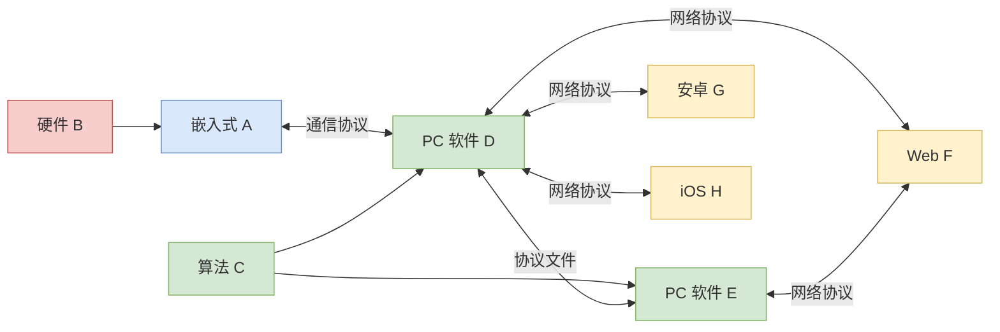
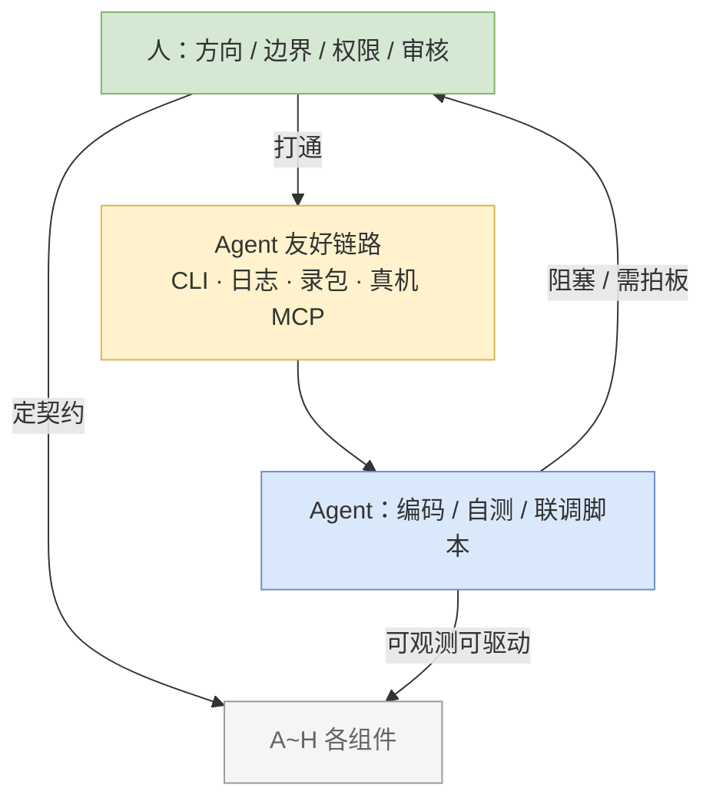

## Foreword

[上一篇](/2026/06/24/Agent-Workflow/)那套 Agent 工作流其实并不完善，它只是当下**妥协**出来的一套流程——文档先行、人卡在几个关口审一审、`task.md` 记着进度。说白了，是拿「流程纪律」硬填 Agent 接不进现有工程链路的坑。

那理想的工作流长啥样？光有纪律不够，还得往下再走一层：**把调试、测试、联调都改造成 Agent 能直接上手的样子**，人退到只管设计和审核。


## 一个够复杂的例子

先摆个够复杂的项目当靶子——能把它捋顺，剩下大部分工程场景也就差不多了：

```
嵌入式软件 A  基于 硬件 B
算法 C        服务于 PC 软件 D 和 PC 软件 E
PC 软件 D     基于通信协议 与嵌入式软件 A 交互
PC 软件 E     基于特定协议文件 与软件 D 交互
Web 软件 F    基于网络协议 与软件 D、E 交互
安卓端 G      基于网络协议 与软件 D 交互
iOS 端 H      基于网络协议 与软件 D 交互
```

这里先不考虑额外的自动化测试工程（就是那种独立于业务架构、单独起一套的测试工程）。我的想法是：测试能力最好长在每个组件自己身上，而不是另起一座测试孤岛。



这张图里，**每条箭头都是 Agent 联调时要跨的边界**。理想情况下，边界两头都该露出「机器能读、机器能调」的接口；可现实里呢，很多边界就只有个 GUI、一台示波器、或者一段得靠人眼看的波形——Agent 走到这儿就断了，再往前一步都迈不动。

| 边界 | 理想态里 Agent 能用的接口 | 现实里常见的断点 |
|------|---------------------------|------------------|
| A ↔ B | 仿真器 / 真机 MCP、寄存器 dump、固件烧录 CLI | 只有 JTAG 调试器，外加人眼看灯 |
| D ↔ A | 协议帧日志、回放脚本、mock 设备 | 只有串口助手，肉眼对十六进制 |
| D ↔ E | 协议文件 + 结构化 diff | 二进制专有格式，连 schema 都没有 |
| D ↔ F/G/H | HTTP/gRPC 契约 + 集成测试 API | 一堆 UI 点击流，没有 headless 入口 |
| 算法 C | 固定输入输出向量、基准测试 CLI | 只有 MATLAB 图，没法量化断言 |

一句话：上篇解决的是「文档和代码怎么对上」，这篇要解决的是「Agent 到底摸不摸得到这些边」。


## 人把路铺好，Agent 才能跑闭环

理想的 Agent 工作流，我觉得能一句话概括：

**该人干的人干好——定方向、划边界、把物理和权限上的路打通；编码、联调、测试丢给 Agent；最后审核还是人来拍板。**

这么一来，工程师的身份其实变了：从「自己埋头写代码」变成「设计系统 + 管 Agent」。不是说细节就不管了，而是把细节约束提前写进一个 Agent 能读、能跑、还能自己判断对错的环境里。


## 假如上下文真的无限

先做个假设：要是 Agent 上下文接近无限，不会「聊着聊着就忘了 S8 之前不能写代码」，那工作流就能尽量照着人类团队那套来搭——产品提需求、开发写实现、测试验结果、负责人拍板，只不过每个岗位都能换成 Agent，人只挑几步插手。

但有个坑特别容易忽略：**上下文无限 ≠ Agent 就可靠了。**

- 会话一长，早期定的规矩照样会被慢慢带跑偏，外部事实源（`task.md`、wolai 定稿）还是省不掉
- 跨会话没有「责任连续性」，得靠文档和关口一棒一棒接
- 「记得住」不等于「判断对」——复核、追溯表该做还得做

所以哪怕上下文不再是瓶颈，流程纪律和那些能被观测的边界，依旧是硬需求；区别只是你能腾出更多精力，去搞「链路打通」这件正事。


## 人该干啥

理想态里，人确实不用一行行去写实现了。但下面这几件事，短期内真不好甩给 Agent：

| 人留着的活 | 为啥甩不掉 |
|------------|------------|
| 定方向、划范围 | 「要做啥」得人说了算，不然 Agent 分分钟给你 scope creep |
| 划协议和模块边界 | A~H 之间谁跟谁说话、合同是啥，这得架构师定 |
| 打通物理世界 | 真机、夹具、烧录器、各种权限——Agent 没有手，够不着 |
| 审核拍板 | 安全、业务意图、能不能交给客户，这些 AI 不背锅 |
| 把工程改造成 Agent 友好 | 加 CLI、加结构化日志、加可回放测试——这是落到人头上的新「搬砖」 |

最后一条最关键：理想工作流不是干等 Agent 变强就行，而是**人得主动把环境收拾成一个 Agent 能上岗干活的车间**。


## Agent 的壁垒

要是真打算一切围着 Agent 转，那软件之间的交互、调试、测试都得为它服务。可现在的工具链基本是给人、给业务用的，Agent 在不少环节根本插不进手。

**1. 没有 CLI，也没有能下断言的输出**

测试这一环，特别多是靠人眼判断的，要么软件压根没有命令行式的输入输出。这种工具 Agent 用不了，测试就又被踢回给人。上篇说过那句话：能编译通过 ≠ 能自测。

**2. 图和文之间那道墙（原生 UI 尤其惨）**

UI 的设计和实现之间，在非 Web 的场景下，几乎没有一门 Agent 能操作的「中间语言」——你想用代码或文字精确描述「这个控件偏了 2px」「这个动效不对劲」，太难了。Web 好歹还有 DOM 加截图兜底，桌面和移动端的原生 UI 就更吃亏。

**3. 视频和图文之间，差距更大**

这比静态图又高一层：时序、动画、音画同步……Agent 理解起来成本陡增。录屏加抽帧对比能缓解一点，但离「能下可靠断言」还差得远。这一层现阶段 Agent 基本进不来，只能等技术再往前走走。

**4. 状态和时序这道坎**

很多 bug 根本不在「某一帧画面」上，而是藏在**时序、并发、中断、实时性**里——协议莫名少了一帧、DMA 跟主循环抢资源、电机响应慢了 3ms。这类问题没有一张稳定的文本快照能截下来，Agent 拿不到「现场」，只能干等着人来一句「刚才好像卡了一下」。


## Agent 友好

「为 Agent 改造」不能拍脑袋，我归了四条，拿来挨个对比够不够格：

```
可观测 — 状态能用文本或结构化数据吐出来（日志、dump、协议帧、指标）
可驱动 — 能用命令行 / API / 脚本触发，不靠鼠标点
可断言 — 结果能让程序判定对错，不只靠人眼，不凭感觉
可复现 — 同样的输入能稳定重放（硬件场景下就是能录能回放）
```

四条全占上，Agent 才可能在这个环节自己跑出闭环；缺一条，人就还得在那儿补位。


## 把 Agent 当员工

软硬件联调这块，得能模拟硬件，最好直接把**真机接进流程**——让 Agent 能直接调：烧录、读寄存器、发指令、读传感器，连硬件调试那条链路也接进来。

一句话：**把 Agent 当个正常员工看待，人手里有啥工具，就得给它配上对应的接口。**

以上述项目为例：

- **好处**：不必另起一套独立测试工程架构，协议联调、硬件逻辑、软件互动可以在同一条链路上闭环验证
- **现状难点**：硬件没有接入 Agent——没有「Agent 能发指令、读状态、判定硬件是否稳定」的链路打通。Agent 写完软件补丁，闭环断在真机这一侧，只能等人工测试一遍、口述结果
- **理想态**：Agent 完成编码和可自动化部分的测试；人只做设计评审、安全审核、以及 Agent 够不着的物理操作授权

这其实就是上篇「测试压力全压人身上」的极端版：越靠近物理世界，改造成本越高，可一旦打通，闭环带来的收益也越大。


## 多Agent融合

回到 A~H 那张图，真要并行干，基本就是**一个组件开一个 Agent**，各跑各的会话。那它们之间怎么对齐？靠的不是谁记着谁，而是**协议文档当合同**——边界上的协议、报文格式、接口契约都写死在文档里，改 A 的 Agent 和改 D 的 Agent 各自照着合同来。谁想动合同，就得回到人这儿重新评审。这跟上篇团队版里「多方 Agent + 协议文档联调」是一个意思，只是这里把它当成默认姿势。

还有个容易被忽略的点：Agent 既写代码又写测试，等于自己给自己发合格证。所以人审的时候，重点不光是看代码，更得看**测试本身合不合理**——断言够不够狠、边界有没有漏、是不是为了让用例「变绿」把条件写松了。测试用例的设计意图这一关，还得人来守。


## 改造成本

为 Agent 重做调试、测试链路，是**实打实要砸进去的工程量**，不是改几行 Skill 就完事的：

| 要砸的地方 | 举个例子 | 短期啥感受 |
|------------|----------|------------|
| 协议可观测 | D↔A 通信录包 + 文本回放 | 开发节奏变慢 |
| 原生 UI 可测 | G/H 加 headless 或截图 diff 管线 | 得动客户端架构 |
| 硬件在环 | 真机 MCP、仿真器、安全互锁 | 要硬件团队配合 |
| 规范成文 | MVVM、日志、目录约定写进 `task.md` | 文档变厚 |

**怎么取舍**：小需求、一次性脚本，犯不上全链路改造，上篇那套妥协流程就够用了。但要是个长期维护的多端 + 嵌入式产品，那越早把边界上那四条判据补齐越划算——Agent 能扛的环节越多，人就越往「架构师 + 审核员」那个位置挪。

不是所有项目都得追理想态。关键是先搞清楚**断点卡在哪**，再决定是花钱打通链路，还是干脆让人补位。


## 理想工作流

把前面这些收回到例子上，理想态大概是这么转的：

1. **人**：定义各组件的职责和协议合同；把定稿沉淀到需求 / `task.md`；给 Agent 开通真机、网络、仓库的权限
2. **Agent（可以按组件各开一条会话）**：读合同 → 改 A/D/E… → 用 CLI/API 把自己这块测了 → 跨边界的就用录包 / mock / 集成脚本联调
3. **人审核**：协议变更、安全相关、UI 主观体验、真机实飞——关口不过就不合并



说到底，上篇拼的是**文档纪律**，这篇拼的是**环境纪律**。两样叠一块，才勉强够得着「Agent 写完就能交付、人只管设计和审核」那个理想。


## Summary

上篇那套妥协流程，解决的是「别让 Agent 跑偏」；这篇想再往前一步，解决「别让 Agent 卡在链路外头」。几个结论：

- **协议边界就是 Agent 的联调边界**，每条边都得往「可观测、可驱动、可断言、可复现」上靠
- **四道坎**：没 CLI、图文、视频、时序——越往后越难啃，嵌入式真机是最硬那块骨头
- **人的活儿变了**：少写实现，多去划边界、打通物理渠道、改造环境、做审核
- **上下文再大，也替不掉**外部事实源和关口
- **改造成本是真金白银**，得按项目掂量——小需求用妥协流程，长期多端、嵌入式才值得砸链路下去

理想不是「Agent 啥都能干」，而是「该它闭环的地方，它真能闭上」；闭不上的，人就老老实实补位，别假装全自动。

往远了说，这事不光取决于 Agent 多聪明，更取决于**整条工具链愿不愿意把「机器能用的接口」露出来**——厂商给硬件、给软件配上 CLI 和 MCP，给调试器留个程序能调的口子。这一步迈出来之前，理想工作流就还只是「理想」。


## Quote

> 人手里有啥工具，就得给 Agent 配上对应的接口——不然所谓工作流，只是换了个写代码的实习生，谈不上什么新工种。
